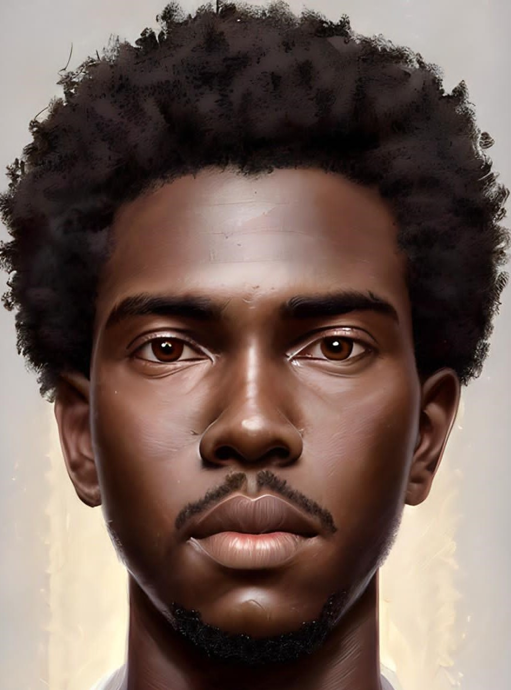
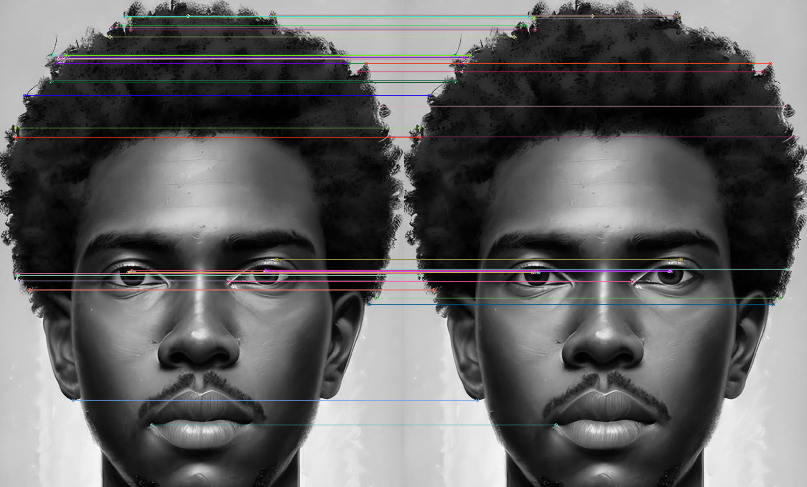

# Feature Matching with ORB

This project demonstrates feature matching between two images using the ORB (Oriented FAST and Rotated BRIEF) algorithm in OpenCV. The application allows users to select two images and then performs feature matching to find common features between them.

## Requirements

- Python 3.x
- OpenCV
- NumPy
- Tkinter (usually included with Python)

## Installation

1. Clone the repository:
    ```sh
    git clone https://github.com/yourusername/Feature-Matching.git
    cd Feature-Matching
    ```

2. Install the required packages:
    ```sh
    pip install opencv-python-headless numpy
    ```

## Usage

1. Run the `main.py` script:
    ```sh
    python main.py
    ```

2. Use the GUI to select two images for feature matching.

3. Click on "Match Features" to see the matched features between the two images.

## Example

### Input Images

Image 1:


Image 2:


### Result Image

Matched Features:


## Explanation

The script performs the following steps:
1. Allows the user to select two images using a file dialog.
2. Reads the selected images in grayscale.
3. Uses the ORB algorithm to detect keypoints and compute descriptors for both images.
4. Matches the descriptors using the BFMatcher with Hamming distance and cross-check.
5. Sorts the matches based on distance and draws the top 50 matches.
6. Displays the matched features in a new window.

## License

This project is licensed under the MIT License. See the [LICENSE](LICENSE) file for details.
